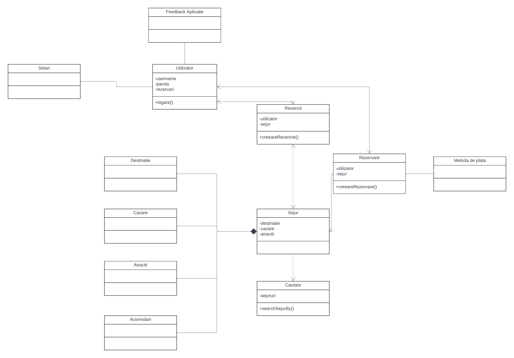

# Agentie de turism
### Vladu Marian-Dumitru

## Descriere
Aplicatie desktop care faciliteaza alegerea si rezervarea unui sejur in functie de locatie, pret, rating, servicii oferite si alte criterii cu interfata estetica/placuta la vedere.
Aplicatia o sa permita cautarea sejururilor dupa locatie (oras, tara, continent), filtrarea rezultatelor dupa criterii, cautarea sejururilor pe harta, oferirea de ratinguri (in cazul in care persoana a fost deja intr-un sejur oferit de agentie).

## Obiective

* Lista cu sejururi
* Rezervare
    - Anulare rezervare
* Search bar
    - In functie de locatie
    - In functie de alte criterii
* Criterii de filtrare a intrarilor
* Ratings
* Harta cu sejururi

## Arhitectura

Arhitectura (subject to change, nu toate metodele si atributele au fost adaugate)

## Functionalitati/Exemple utilizare
Lorem ipsum

### Resurse
Markdown Guide, [Online] Available: https://www.markdownguide.org/basic-syntax/ [accesed: Mar 14, 1706]
