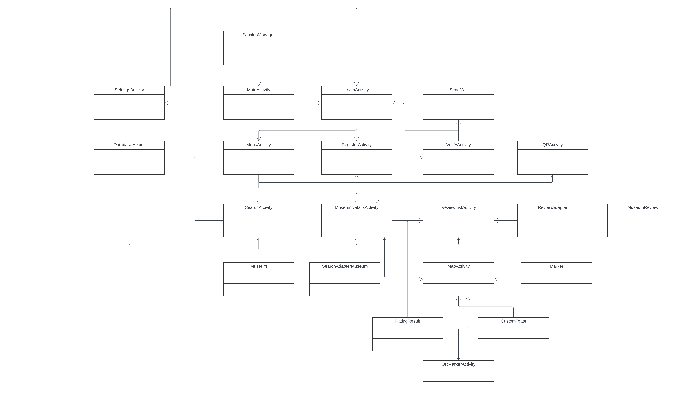

# Aplicatie de Muzeu
### Vladu Marian-Dumitru

## Descriere
Proiectul va consta intr-o aplicatie mobila estetica ca aspect si intuitiva de utilizat, scopul aplicatiei va fi 
dotarea utilizatorului cu o harta de muzeu pentru a facilita navigarea intr-un muzeu, cu ajutorul scanarii 
de cod QR prezentat la exponate sau la punctele de interes din muzeu, va oferi informatii despre 
exponate accesate cu ajutorul hartii interactive, posibilitatea de a posta recenzii in legatura cu muzeul in 
cauza sau cu un anumit exponat din muzeu, toate aceste informatii find corelate cu cate un cont 
personal pentru fiecare utilizator.

## Obiective

Realizarea unei aplicatii cu aspect estetic si interfata usor de utilizat cu scopul de a facilita navigarea in muzeu, cautare de muzee, oferirea de recenzii pentru fiecare muzeu, scanare cod QR etc.

## Arhitectura

Arhitectura (subject to change, nu toate metodele si atributele au fost adaugate)

## Functionalitati/Exemple utilizare

* Lista muzee si search bar
* Scanare cod QR
    - Pentru muzee
    - Pentru exponate
* Harta interactiva
* Ratings
* Logare, verificare email, etc.

### Resurse
Markdown Guide, [Online] Available: https://www.markdownguide.org/basic-syntax/ [accesed: Mar 14, 1706]
