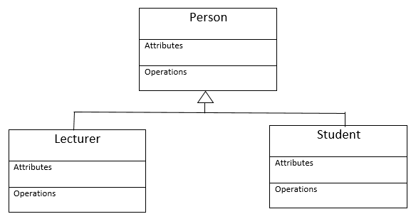

# Agentie de turism
### Vladu Marian-Dumitru

## Descriere
Aplicatie desktop care faciliteaza alegerea si rezervarea unui sejur in functie de locatie, pret, rating, servicii oferite si alte criterii.

## Obiective

* Lista cu sejururi
* Rezervare
* Search bar
    - In functie de locatie
    - In functie de alte criterii
* Criterii de filtrare a intrarilor

## Arhitectura
Lorem ipsum ...

Lorem ipsum ...

## Functionalitati/Exemple utilizare
Lorem ipsum

### Resurse
Markdown Guide, [Online] Available: https://www.markdownguide.org/basic-syntax/ [accesed: Mar 14, 1706]
